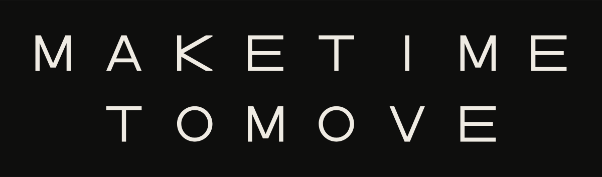
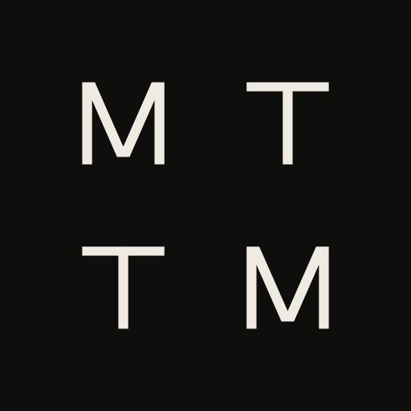
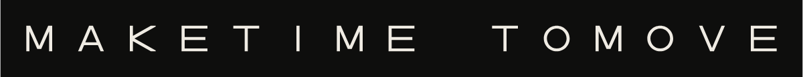
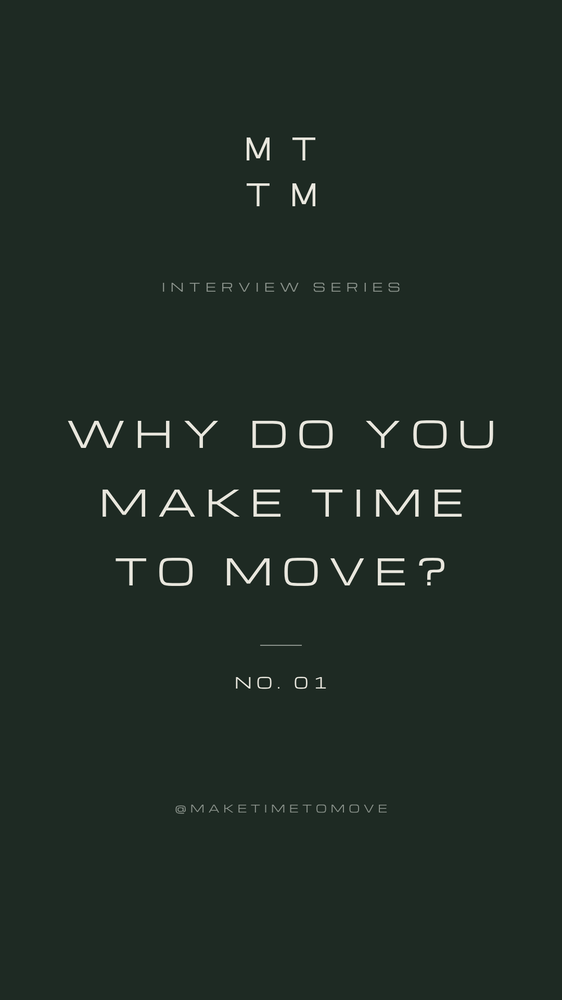
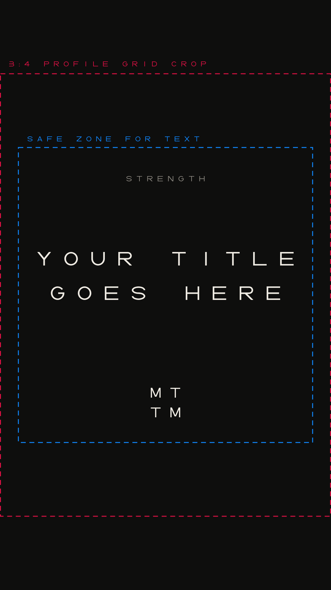

# Make Time To Move · Brand Guidelines

Version 1.0 · October 2026 · @maketimetomove

The single reference for the Make Time To Move identity across Instagram, the website, marketing materials and merchandise. Asset files live alongside this document in `brand/`.

## 00. Brand brief

Copy this summary into any new chat, brief or design tool so that future work matches the brand.

```text
MAKE TIME TO MOVE (MTTM) · @maketimetomove
Personal training brand and healthy-living movement. The name is a command that answers the most common reason for not exercising: "I don't have time."
Pillars: Strength, Mobility, Mindset. Signature series: stranger interviews asking "Why do you make time to move?"
Feel: minimalist, clean, confident, high-end, quiet. Restraint over loudness. Never gym-floor aggressive.

LOGO: custom equal-width capitals, thin monoline (stroke = 12% of letter height). Every letter sits in a 1x1 square box. Letter gap = 1 letter, line gap = 1 letter.
  Wordmark (primary): MAKETIME over TOMOVE, centred, no word gap. 15 x 3 units.
  Monogram: M T over T M, same spacing, a 3 x 3 square. Used for avatar, favicon, labels, small merch.
  Single line: MAKETIMETOMOVE in one run, no word gap. For hats, sleeves, website header, narrow spaces.
  Heavy cut: same letters with a thicker stroke, for favicons and embroidery only.
  Clear space = 1 letter height on all sides. Always use the supplied files. Never retype the logo in a font.

COLOUR (two colours per layout, plus one grey for secondary text):
  Master: Ink #0E0E0D + Bone #EFEBE3 (grey Stone #8F8B83).
  Strength: Bone on Ink. Start Here: Ink on Bone.
  Mobility: Ink #0E0E0D on Sage #B7C0AE (grey Fern #5F665A).
  Mindset: Mist #E3E7EC on Midnight #121A26 (grey Slate #87909C).
  Interviews: Chalk #E8E6DD on Moss #1E2A23 (grey Lichen #8C948D).
  Utility: pure Black #000000 and White #FFFFFF for one-colour reproduction.
  No gradients, effects, shadows, outlines or extra colours.

TYPE: MTTM Lettering is the brand's own custom font (capitals only, spacing built in, so leave letter-spacing at 0). Use it for headlines, labels, title cards and slogans. Regular for general use; Heavy only for small sizes and embroidery. Font files: fonts/mttm-lettering-regular.woff2 / .otf and -heavy. For websites it is embedded in tokens/mttm-brand.css and in Appendix 13 of the guidelines. Never substitute another typeface (no Michroma, no lookalikes). Manrope (Google Fonts) for body text and anything read as sentences (400/500/600).

VOICE: short, direct, imperative, calm. No hype, no fitness clichés, no exclamation marks. Examples: "Make time to move." "Start where you are." "Why do you make time to move?"

IMAGERY: natural light, real people, honest movement, muted or black-and-white colour, generous negative space. No stock gym imagery, no neon, no flexing for the camera.

RULES FOR AI ASSISTANTS AND DESIGNERS
  1. Use the supplied logo files (SVG or PNG). Never draw, retype or approximate the logo. The single line is always MAKETIMETOMOVE in one run: never add a space or word gap between MAKETIME and TOMOVE.
  2. Headlines and labels: MTTM Lettering only, capitals, letter-spacing 0. It is a custom font that exists only in the brand files: fonts/mttm-lettering-regular.woff2 / .otf (and -heavy), tokens/mttm-brand.css (font embedded), or the embed code in Appendix 13 of these guidelines. Never substitute Michroma or any other typeface. If you cannot access the font, ask for the files before producing work.
  3. Body text: Manrope. Never use any other typeface.
  4. One theme per layout. Default to Ink & Bone unless the content belongs to a pillar.
  5. Keep on-image text to 8 words or fewer, in the brand voice.
  6. Instagram stories and reels (1080 x 1920): keep text out of the top 250 px and bottom 340 px; keep reel cover text inside the centre 1080 x 1080.
  7. Keep 1 letter height of clear space around every logo. No gradients, shadows, outlines, effects or extra colours.
  8. When unsure, choose less: more space, fewer elements, one message.
```

## 01. Concept

**Make Time To Move** is a training habit for a healthy way of life. It is a movement first, and a coaching business second. The name is a command. It answers the most common reason people give for not exercising, “I don’t have time,” with a calm instruction instead of a pitch.

- **Strength:** training that builds capability for everyday life.
- **Mobility:** moving well, recovering well, staying able.
- **Mindset:** the habit itself. Its signature format is street interviews with strangers, asking “Why do you make time to move?”

The identity follows the same idea. One unit of space repeats everywhere: every letter is the same size, and every gap is the same size. The structure is visible, calm and unhurried. Nothing shouts.

## 02. Logo system

Four marks drawn from one set of custom letters. Always use the supplied files and never retype the logo.



| Mark | Use | Files |
|---|---|---|
| **Wordmark** (primary) | Default for everything with room: website hero, posters, merch fronts, decks. | `logo/wordmark/` |
| **Monogram** M T / T M | Instagram avatar, favicon, labels, chest prints, highlight covers, sign-offs. | `logo/monogram/` |
| **Single line** | Hats, sleeves, back yokes, website header bar, email footers, narrow spaces. | `logo/single-line/` |
| **Heavy cut** | The same letters with a thicker stroke. Only for favicons (≤ 64 px) and embroidery. | `logo/monogram-heavy/`, `logo/wordmark-heavy/`, `logo/single-line/*-heavy-*` |





## 03. Construction

The unit **U** is the letter height. Everything in the identity is measured in U.

- Every letter sits in a **1 U × 1 U** square. All letters share that width and height.
- Gap between letters: **1 U**. Gap between the two lines: **1 U**. The wordmark is 15 U × 3 U.
- Line 2 (TOMOVE) is centred under line 1 (MAKETIME) on the same columns. There is no word gap: the line break separates the words.
- Monogram: M T over T M with the same gaps, giving a **3 U × 3 U** square.
- Single line: MAKETIMETOMOVE in one run with the same 1 U letter gaps and no word gap, giving 27 U × 1 U.
- Stroke: 12% of U for the regular weight, the same as the regular font weight. The heavy cut is 22%.
- The letters are custom: square boxes, a circular O, a plain-stroke I, and a K made of two straight diagonals meeting the stem. No font reproduces them, so never retype the logo.

## 04. Clear space & minimum sizes

Keep at least **1 U** (one letter height) clear on every side of any mark. Nothing goes inside that zone: no text, edges, other logos or busy image detail. All supplied files already include it.

| Mark | Digital minimum | Print (paper) | Screen print | Embroidery |
|---|---|---|---|---|
| Wordmark | 160 px wide | 40 mm wide | 75 mm wide | Heavy cut, ≥ 100 mm wide |
| Monogram | 64 px (regular) · 16–48 px heavy cut | 15 mm | 20 mm | Heavy cut, ≥ 25 mm |
| Single line | 300 px wide | 120 mm | 150 mm (heavy cut ≥ 90 mm) | Heavy cut, ≥ 120 mm |

Below the wordmark minimum, use the monogram. At 16 px the monogram reads as a recognisable square, not as letters. That is expected for any four-letter mark.

## 05. Colour

Four themes, each made of two colours plus one grey. One theme per layout; never mix themes.

| Colour | HEX | RGB | CMYK (approx.) | Role |
|---|---|---|---|---|
| Ink | #0E0E0D | 14 14 13 | 0 0 7 95 | Master dark |
| Bone | #EFEBE3 | 239 235 227 | 0 2 5 6 | Master light |
| Stone | #8F8B83 | 143 139 131 | 0 3 8 44 | Grey for secondary text on Ink or Bone |
| Moss | #1E2A23 | 30 42 35 | 29 0 17 84 | Interviews ground |
| Chalk | #E8E6DD | 232 230 221 | 0 1 5 9 | Light on Moss |
| Lichen | #8C948D | 140 148 141 | 5 0 5 42 | Grey on Moss |
| Midnight | #121A26 | 18 26 38 | 53 32 0 85 | Mindset ground |
| Mist | #E3E7EC | 227 231 236 | 4 2 0 7 | Light on Midnight |
| Slate | #87909C | 135 144 156 | 13 8 0 39 | Grey on Midnight |
| Sage | #B7C0AE | 183 192 174 | 5 0 9 25 | Mobility ground (light) |
| Fern | #5F665A | 95 102 90 | 7 0 12 60 | Grey on Sage |
| Black | #000000 | 0 0 0 | 0 0 0 100 | Utility: one-colour reproduction |
| White | #FFFFFF | 255 255 255 | 0 0 0 0 | Utility: one-colour reproduction |

*CMYK values are mathematical starting points, not colour-managed. For print and merch, ask the printer to match the HEX values to a physical swatch (Pantone or their own ink system) and approve a proof before a run. For large solid Ink areas on paper, use a rich black (C60 M40 Y40 K100).

### Themes by pillar

| Pillar | Theme | Lettering | Ground | Grey (secondary) | Contrast |
|---|---|---|---|---|---|
| Start Here | Ink & Bone (light) | Ink #0E0E0D | Bone #EFEBE3 | Stone #8F8B83 | 16.2:1 |
| Strength | Ink | Bone #EFEBE3 | Ink #0E0E0D | Stone #8F8B83 | 16.2:1 |
| Mobility | Sage | Ink #0E0E0D | Sage #B7C0AE | Fern #5F665A | 10.3:1 |
| Mindset | Midnight | Mist #E3E7EC | Midnight #121A26 | Slate #87909C | 14.1:1 |
| Interviews | Moss | Chalk #E8E6DD | Moss #1E2A23 | Lichen #8C948D | 11.9:1 |

- **Ink & Bone is the master.** Use it for the profile, the website, general posts and most merch.
- Greys are only for secondary text, captions and dividers. They are not for logos or body copy on light grounds.
- Black and white are utilities for one-colour jobs: stamps, single-ink prints and partner logos.
- Approved logo pairings are exactly the lettering/ground pairs above, plus each pair inverted, plus single-colour logos on photography with enough contrast.

## 06. Typography

| Role | Typeface | Setting | Use |
|---|---|---|---|
| Logo | MTTM custom lettering | Supplied artwork only | Logos. Never typed. |
| Display & labels | MTTM Lettering (brand font, `fonts/`) | Capitals · letter-spacing 0 (built in) · Regular; Heavy for small sizes | Headlines, story titles, section labels, highlight text, merch slogans |
| Body | Manrope (Google Fonts) | Sentence case · 400 / 500 / 600 · line-height 1.6 | Captions, website copy, emails, documents |

### The alphabet · MTTM Lettering

This is the brand font. Every character below is drawn from the font files. Letters and figures sit in a 1 U square; punctuation is narrower. In use, characters are 1 U apart and words are 3 U apart.

Character set (Regular and Heavy): `ABCDEFGHIJKLMNOPQRSTUVWXYZ0123456789.,:!?'’"-–—/·@+#()&` · lowercase keys type capitals.

- Square box for every letter and figure; constant stroke of 12% of the letter height (Heavy: 22%).
- O is a perfect circle; 0 (zero) is a rounded square; I is a single stroke; K is two straight diagonals meeting the stem; W is M upside down.
- A, M and V have small flat points rather than sharp tips. C, G, S, 2, 3, 5, 6, 8, 9 are built from the same ellipse geometry as the O.
- Spacing is part of the font: 1 U between characters, 3 U between words. Always leave letter-spacing at 0.

- MTTM Lettering is the logo’s alphabet: every character in a square box, a circular O, and 1 U gaps between characters and 3 U between words. The spacing is built into the font, so always leave letter-spacing at 0.
- Install `fonts/mttm-lettering-regular.otf` and `-heavy.otf` for Canva, Figma and desktop apps. Use the `.woff2` files on websites.
- Capitals only (lowercase keys type capitals). Keep lines short: 2 to 4 words, centred or left-aligned, never justified, never for paragraphs.
- Characters: A–Z, 0–9 and . , : ! ? ' " - – — / · @ + # ( ) &. The zero is a rounded square so it is never confused with the circular O.
- Use Heavy only for labels smaller than about 14 px tall on screen and for embroidery.
- The logo stays fixed artwork. Never type it, even though the font has the letters.
- On websites, load MTTM Lettering from `tokens/mttm-brand.css` (font embedded) or the code in Appendix 13. Never substitute another typeface. The generic `sans-serif` keyword is the only fallback and should never be visible.

## 07. Instagram

Templates live in `instagram/`. Every PNG has a matching SVG; files ending in `-template.svg` keep editable text (install MTTM Lettering and Manrope).





| Asset | Size | Notes |
|---|---|---|
| Avatar | 1080 × 1080 | Monogram, Bone on Ink. Its diagonal stays inside the circular crop. |
| Highlight covers | 1080 × 1920 | Pillar colour plus monogram. Instagram shows the pillar name underneath, so the cover carries no words. |
| Interview title card | 1080 × 1920 | Moss theme. Change the episode number in the template file. |
| Lower third | 1080 × 1920, transparent | Name in MTTM Lettering, caption in Manrope. Sits above the story UI. |
| Reel covers | 1080 × 1920 | One per pillar. Keep text inside the centre 1080 × 1080 so it survives the 3:4 grid and square crops. |

### Feed aesthetic

- The grid reads as calm blocks of the five theme colours, interleaved with photography. Don’t chase every trend.
- Each post uses one theme, and the theme follows the pillar.
- Use typography posts for questions and principles: MTTM Lettering, centred, generous space, at most 8 words.
- Captions follow the voice: short, plain, no emoji clusters, few hashtags (3 to 5, at the end).
- Interview videos open on the title card, use the lower third for the person’s name, and close on the monogram.

### Imagery

- Natural light, real places, real people mid-movement. Honest effort over posed perfection.
- Grade toward muted, slightly cool colour, or black and white. Skin looks like skin.
- Leave negative space for type. Frame interviews at eye level, subject centred, handheld but steady.
- Avoid stock gym imagery, neon, heavy filters, shirtless flexing for the camera, and before/after shots.

## 08. Website & digital

Design tokens are in `tokens/mttm-tokens.css` and `tokens/mttm-tokens.json`. Use them to theme any site, app or deck so it matches the brand.

- Default theme: Bone text on Ink. Use Ink on Bone for long reading pages. Pillar pages may switch theme via `data-mttm-theme`.
- Header: the single-line logo at 240 to 360 px wide. Footer: the monogram. Favicon set: `logo/favicon/`.
- Layout: generous whitespace on an 8 px spacing scale, content up to about 1200 px, centred hero with the wordmark.
- UI: square corners (0 to 2 px radius), 1 px hairline rules, no shadows or gradients. Buttons are solid lettering-colour blocks with MTTM Lettering labels.
- Body text: Manrope 17 to 18 px, line-height 1.6, at most about 70 characters per line.

```html
<link rel="icon" href="/favicon.ico" sizes="any">
<link rel="icon" href="/favicon.svg" type="image/svg+xml">
<link rel="apple-touch-icon" href="/apple-touch-icon.png">
<link rel="stylesheet" href="mttm-tokens.css">
<body data-mttm-theme="strength"> … </body>
```

## 09. Merchandise

Print-ready files are in `merch/`: transparent, one colour, as SVG (vector, preferred by printers) and PNG at 300 dpi.

| File | Mark | Print width | Use |
|---|---|---|---|
| `merch/front-wordmark/` | wordmark | 11 in (279 mm) | Tee / hoodie full front |
| `merch/back-wordmark/` | wordmark | 12 in (305 mm) | Tee / hoodie full back |
| `merch/chest-monogram/` | monogram | 3.5 in (89 mm) | Left chest print |
| `merch/chest-monogram-embroidery/` | Heavy cut monogram | 3 in (76 mm) | Left chest embroidery |
| `merch/hat-monogram-embroidery/` | Heavy cut monogram | 2.25 in (57 mm) | Cap / beanie front embroidery |
| `merch/yoke-single-line/` | single line | 10 in (254 mm) | Back yoke / across shoulders |
| `merch/sleeve-single-line/` | Heavy cut single line | 3.5 in (89 mm) | Sleeve or hem (heavy cut) |

| Garment | Print / thread |
|---|---|
| Ink (black, vintage black) | Bone |
| Bone (natural, ecru) | Ink |
| Moss (forest, dark green) | Chalk |
| Midnight (navy) | Mist |
| Sage | Ink |

- One colour per garment. Use screen print or DTG for prints, and embroidery for caps, beanies and chest marks.
- Embroidery always uses the **heavy cut** artwork, because satin stitches need a stroke of about 1 mm or more.
- Match garment and ink colours to the palette by physical swatch, and approve a sample before ordering a run.
- Set slogans in MTTM Lettering, as one or two short lines, using brand-voice lines only.
- Place a small monogram woven label or neck print on garments whose front carries a slogan.

## 10. Brand voice

Short, direct, imperative. Calm confidence. Say less, and mean it.

| Do | Don’t |
|---|---|
| Short sentences. Verbs first. | Long build-ups, rhetorical hype. |
| Plain words a friend would use. | Fitness clichés: “beast mode”, “no excuses”, “crush it”, “grind”, “shred”. |
| Invite: “Start where you are.” | Shame: “What’s your excuse?” |
| Full stops. | Exclamation marks, all-caps shouting in body text, emoji strings. |
| Real people, real reasons. | Transformation promises, “summer body”, before/after framing. |

## 11. What not to do

- Don’t add gradients, shadows, glows, outlines, textures or any other effect to the logo.
- Don’t stretch, squash, rotate, skew or re-space the letters. The equal spacing is the logo.
- Don’t type the logo, not even in MTTM Lettering. Always use the supplied artwork.
- Don’t recolour outside the approved pairs, and don’t put two theme colours in one logo.
- Don’t add a word gap or a space anywhere in the logo. The single line is always MAKETIMETOMOVE in one run, and in the wordmark TOMOVE stays centred under MAKETIME.
- Don’t place the logo on busy photography without enough contrast, or inside its clear space.
- Don’t lock the logo up with taglines, icons or other marks. Keep each mark on its own.
- Don’t use the heavy cut at large sizes on screen. It exists for small sizes and thread.

## 12. Files & naming

Everything is prefixed `mttm-`, then the mark, then the colourway (`lettering-on-ground`, or a single colour for transparent files), then the size in pixels for PNGs.

| Folder | Contents |
|---|---|
| `logo/wordmark/` | Wordmark: SVG plus PNG at 600, 1200 and 2400 px wide, in 11 colourways |
| `logo/monogram/` | Monogram: SVG plus PNG at 128, 512 and 1024 px, in 11 colourways |
| `logo/monogram-heavy/`, `logo/wordmark-heavy/` | Heavy cut for favicons and embroidery |
| `logo/single-line/` | Single-line logo, regular and heavy |
| `logo/variants/` | Layout study: variant A (centred, chosen) and B (nested) |
| `logo/favicon/` | favicon.ico, favicon.svg, 16 / 32 / 48 px, apple-touch-icon, 192 and 512 px icons |
| `instagram/` | Avatar, highlights, interview title card and lower third, reel covers (+ editable templates) |
| `merch/` | Print-ready transparent files in Bone, Ink, White and Black |
| `fonts/` | MTTM Lettering font files: OTF (install for Canva, Figma, desktop) and WOFF2 (websites), Regular and Heavy, plus a specimen page |
| `tokens/` | `mttm-brand.css` (self-contained: tokens plus the embedded brand font), `mttm-tokens.css` and `.json` |
| `_src/` | Source fonts and the build scripts that generate every file |

Typefaces: MTTM Lettering is the brand’s own custom font. Michroma (© Vernon Adams, SIL Open Font License) was the original drawing reference only and is not part of the brand. Manrope (© Mikhail Sharanda) is free under the SIL Open Font License.

## 13. Appendix · web font code

The complete MTTM Lettering font, embedded as code. Paste it into any website’s CSS and the brand font works with no other files. Use it whenever the font files themselves are not available.

- The same code, on single lines, is in `tokens/mttm-brand.css`. Prefer that file when you have it.
- As shown, this is valid CSS: each line inside the data string ends with a backslash, which CSS reads as a line continuation. If you join the lines, delete the backslashes and line breaks so the base64 data is one unbroken string.
- Then set headlines with `font-family: 'MTTM Lettering'`, capitals, `letter-spacing: 0`. Never substitute another typeface.

```css
@font-face {
  font-family: 'MTTM Lettering';
  font-weight: 400;
  font-style: normal;
  font-display: swap;
  src: url('data:font/woff2;base64,\
d09GMk9UVE8AAAo8AAkAAAAAETAAAAn2AAEAAAAAAAAAAAAAAAAAAAAAAAAAAAAADZZnBmAAgTIB\
NgIkA4FkBAYFhS8HIBuLEFGUTVYS4EdC5uaNZlFULhFlW5tK2ZG5i+94HiHJ7PU0579L7r27WtBA\
STJ3qWIlhVoqNBXFg1gNqYhDxVMzvlfcA4WK5mtqkoqxl+7xy/PG7f1tQZplEaYYU0nEXf1PAC74\
f9cymymTxrxXuUKXjayRbWZ/d/5idkqUEqAikFUKgM8RC38ayfgTRpzOIQbZxrwuqVjqF+Bm1oTA\
f2sOX4QLF5SUkZH0h9Axb5uiPsKIQe/BoBg1Sm0enLh93+vNp898HKYaAzeI8sPQB9NazFMHs5Vw\
+F9B6u7EbyU+SC3EiGgQMzIIEREtokNGIgvxRcYgdZCaCI9UCxGQVkU4BpIEq31cINeY65oS7hB3\
jvugCdGEa9JrbJ3VvNOm90qth9fwVj5zZvHH+fv0hBKaTIfS7fQNC2Cd2e/slNBQmC0sETYLR4Qy\
sboYLNYX24hxYo44UJwuLqwWUC262shqJdWuVM8x0UnwOchr99qr7OxaVaBecSku1SXoimzLvaaR\
rsczve4Lxx2IVapnHGO3HM9UDqVYqPbUgwX+Bwv+T3XcnoUyioHvhyeVf2bdaLdT3rd346nzhsqo\
JyhKakvmrtLqoVgxCa6yrPj4xGybrJqgnA5bBM+E25eyC9Ozu8iS79EeBH6gqXhfKnc5SmN7t8iO\
NGIo1gAdREIknG4T+vZRduwJ+bYk/X0SquujnxEzMQZJJoLnQqasFtHld4X6QCsgkOoXdpVVnUKr\
KkfhpADBlajDSERzag6mbOu1u1QVipXL1v0yFCmqq8rOwGVuKFd+6pafQKD1198dwsEEnX+Tl7jw\
gQ2KGYZMRm0DNOj/Lh+7CuJOy9fP0H8TQs8jP9FJO2Q7lru9diteV7fDdetSbRh0sXx+d4WHWXqU\
TkJwKFiMkAl/weY3g89W/CxgJNZAHYYisVS8KZA477mTKZNxJ4XgDUy9Df8oayO6AYMFFbJkp1Vw\
RJ5Xa7X+9ylHGQxWJ35zwGBlIlWPur12JALOU0/iPOUkRYJ9Q2BKkQoU/L12qwpMLVKAor/DQFkE\
l2BgL0zr4h2XgMwgc6RhFnn7VJxKBAPx9VMgIOopirJaxNx4Uw+zlAjh9qWsuLj0rOT6Pt27ueHA\
JflGCn28j8X8TS+V7vn3uUGVSEqfq+uYxMKeMs6B4emJMA3707F9e0/PNSrmBGkfmdvopMD9wvA8\
HKPPFc1UQvSi08+Vl7/Gc5Ou2fGym1VizJOxaGZG8mQ2h0y4yIqPR1EyhtIJycrMZdKM+bnwSSUQ\
QkiANl6tHpxVWnc+CZxpnQuf9VYnBmciKYvAEwwkZ4j6Pa05pK9Vv6zrKV+iHXCmyv7FASsQxu16\
ti4QAeYpJ71CPUmBJEObowwHKxPrOL4adSJVjiZbna8MFsI+Xwv30a8lDI/DM1jLaUldAXnEuqB1\
pzPLwGfoshhnJff31y9icELlZkynW9DpBucWNqMETigcXV9fQAc6aTKv9g9T/lG20xdVdttGEahk\
dTuvgstBsDs6u30AXxmWC+Ab9QFFCflAFKNCkWAg+r4OhQYuvkt6xT+I5f9cqrgtHS24fSmuNVJt\
6/S4LlJ5XsWfeUopxk1j6MQcRxg4IVuZrspivZtVQI3zgV03K04axtQLajs60qYm2dRgkxJGNwqB\
Mz6N9kpNkUgNdrsHPco775IP7dt0+uKg1mRTTKyPZqhdbfo+ndY4qvSeyPkgN8SDxYUWpRX77XfU\
OdS2ahKdbFMKmdKYxyf4QBBHCsuCK1+DiJ3NrzFYVnWQ1/Gs6C2/zaNbKR07dk1pIauFRZ3ugZqo\
YPoiMXPosAXzRsiQB1tR48B5+Gdi/8KceakhkwWstgIsFkgzunisi9Wu3p8jr2ePQaS/nbiyrszo\
GZFos+GUixzStkw5x1TfLr44FN/uRg/rRJ/pSeXNxGtRe+SKfUcuXDNUovEJtsbDjM3MKUcyKwZK\
UYMTU7oZ6gKlBtUFgdBVUH0ZynmsGVFWPeeM4Z7sqURcppp1yVJeZGJMBBmPCqQvETJ37Vy6fLuM\
ebgVNA6YB3+WHTh8dvmVkF8FqDYXLa8wzWjjoS5Us3dYKRex5ijSSb1TixOvEUSZywVzcwiVdd5d\
8DnoxYtodu6QdSwTfenCe8IF8KcrQICUC8N53I0rIUfvVhZb2fwqux6QbuI9P66sGveJlT49AwQ8\
zU1KapqLRBpUgLFuCBTAWPL5zzeGL+j3CBtjF78W9SQoVlfxSPZuztDlIMd6Qazvg+LXVMwBkTns\
CrzA6UKnCoatFwUpRS61yJVOSvba4yX4Ed7fIl8fzpAT7xzgeg3UuGS4ogJE9KNugeAPIJ2Ul5Ww\
1TuX797TnHnxInzFM+RIyLOOZyVjRq4aZrS0b2+xPGj/6syxDXt2ylCdNSqwxCExQjzfu//hM2cO\
HD5x4kBhbm7/wt6yzsRPM65OPCa7ITnVcGE8JFkxia02FJWiS3o3xIIZY4eFLjS/m9RCrBVjh4U2\
MIcP6zEYB530+9O/E3Tfbcojb74e68RFoIzNDdjcgzLE3tIzwXI1+ROIBhCdn15dldTO8FmjifDK\
7myAYh0xuYHFLn1toE6FB2RobmXNI0BGN0gdeTdbEPC/MqwLAXTpyqWr8FmNX1YbGrtwQB7DlhBK\
X5XcufvE4Gn6JxLUtG3E+OUTVk2UPGzqLzM3bDJcOHOstPRMXmbekDNlxdLi6dPHvxPjlKmLFk6V\
J/2CIY6zvWmr/hld2xqwJgRGQNMnru0nzkt4ETboYR4Oo8MGpE1MNCIfXea6dOr07Q2yTh6inSpu\
OVnwDuLOQIvdxl6DtGc+QrRzfjBBwM3xXPNiEUHMFxhRY2Bm4ObevN9elokvrZrqCddYK62110O+\
Kf7wHIHmkB8gZg1FitZaOx3kK8CwD6hPCPnh8b79lRdct0GBqTf9ATgmdYUhhJBGDt4cJ1yU5lqK\
1IJVM6EsGooRoSkOIRzytfjt1Dyf2G+iVvuKIOTFC9s57sQ1+7EMmnLrTBq+RuILTi+FE9dnGcI5\
wFZVpc8qYxnyzg/t2ForzWbUyAyB74gPXTuYNNOO+XjMvX2le+Rj8mwdixmRfjoY47RGRLV3HmuH\
OyJ2pBVCfF31AomA85SjE0E1BC2pllE7ygvSg1K1jKKM3vSjRX5WatxUI4Rk2HSeckyAaugSQLVa\
pA7lNUo2pQyZTZmI/FohqptrT2Wzh8fUjJH/B3vtIxjyA+rmYXcwJ7Dc34TJ4HdeRZsYSzQM4f4p\
PAQPaINxGFirI0mSAkP1Z5ZhsOHncGQmJeEEDi2h0cl4Y42Dw2dGoTEnvUfoh8NUOA6xPy8NxoFn\
MpJkICYpwk/MSNM/w/FnsYAH7MFmE0UNG7YRwyL6cOgyJjLPDVlwHBs4MiYycxq+/OH6afZaBw==') format('woff2');
}

@font-face {
  font-family: 'MTTM Lettering';
  font-weight: 800;
  font-style: normal;
  font-display: swap;
  src: url('data:font/woff2;base64,\
d09GMk9UVE8AAAoEAAkAAAAAETAAAAm7AAEAAAAAAAAAAAAAAAAAAAAAAAAAAAAADZZ9BmAAgTIB\
NgIkA4FkBAYFhRcHIBuJEFGUTVYW4KsC2xg21oODWampuKX2dodvj7IczR9SN/4oDR9Fw1BENDSc\
fBkhyez/4aY/2qsayUuuPr2VitKZQ93CNDNm7kzMmJmmKxOep53vVxJgFmE4xJg2Geluo+X8ogS4\
DVXXHVT+gwvC/781y03pawCTVIetENmbAADUBIjcw8BXPk/+3/1ebVIAcJjT6gqJRtfIB/f3JX0l\
SDlNiZIiDxWBAuGqB8xurNDueCA1IeV0qiiSrlG7x9gGrk0jOC3xYI7FZoXCFqBgwMeYlWX8Q+gs\
brt1P//KqntoXZVAV4msZlPVm2tl82oXnQefVs8T6FC+uq6leOuNYYByoPB/A4IHeHZwB65AADTA\
oANAgAFuoBsYjwewgCDgAljgGHAAiQUoOpI25noTFUm19nxqD3XKaJnW00UZkuPB5HQO84VFbDJb\
yiT2NI4Pt5ur5N7lhllTPtrM/CB+gT/X4XeHjg6j/EIf0UlNWqEb0P3oOfQe+gZ1RAMcz3O8z/FT\
x96Oy5s9Irp+2reGWlotrZ5mo+o+ebwT76Q7vpXo+u3Lqj5Xea4pzyTii1GagUkM2Q1t2EbtMk4N\
kpjPoGKGKlyr0V5T7G54bFoDmnbP+cu3hV+qs7ds14HKa4RKKcE0kk7mYG75rlZVUVRVkXWLjavE\
Jb66SlpUVb6+sN9pDXhCT9g4Jshnrru0Y9vyJoLg6DUg0LI1wLRzdxo3Bep846X2Xl2eeytbekTZ\
DN5MdsCF3FqbE4ptINPuV/OQ3PBcLSbQy6+eWRYSOqNupZtSSwOn3TkgDsGJRd1UT7MWGoSNMavq\
n1UA+5enEIwLMY3hC7BuCaO3xCfOSo+DnzT+1IO5mw/daaVbcHHEYLEbZzIuaiNPqKWJJCSRjTAh\
Yuwa10QVwTLi5FJf/A+F7E02eob6GXxTRd+80NFlwbmm7SM7SKNfUDFuSHH06WypDxdjFq6zvc+E\
XXOgIuIZsn88KcKES3y2rfbOmIqtWmenz3CUDK+YZMo8mpxe1PwkcazxOI11dIZMkxOhx7FWnflm\
IQb5YP3msxmyFzjjYB2w7CcDuhYzS9h4YU1Ba5YFlJfdW0hDDKJpOSwvfHWVRVUtFv36S40a9sPq\
g3LfuzikhXbBGdfj1Krrd/aCkX3pp987/P6BqqxUDAfJgRTVdmMGDhz/koDr+zTZ2CKbI+cf0xw2\
uX4wTxUTcsHR1a7bn1snnaQqMsQ09Bat2diMoNBKslv0KdGPCHp1SiJWS7OphRx6ehRgchyeszqd\
hIgtWa3bzWzNiS6Qy6YlLQI2WOWgHxXVvIPgrVODjOLxkwsW19mHGzCoePi2rK6xfsHsm1xPI8MT\
E02ZJ5PTtkZf5bMdxFaZioO01fFZ4VRMRgJq5lKd1n83TeYBobnf7SavClMHdbrsWX7V6YGyPVVg\
1XquNs+v6VNV/earXKPdJgPRyL853xVUu1/ra3gla7jT6+P3stgrCk5LqacJS+rNqiSMKE82sFFc\
6iY8AtM8U8qbhEryk4TKhwrJCLnmUJB2SNWyrU/Lnj6rtlmlWVldZS5uNXSrxaxK9nrn8a5hXvfm\
Ck4/nzOtllehFFbj5QSD2vURsz5fJfBTW1TpBkvpCVy+HeNF0ukkbrvuDoD0y7TgoEcLSr43YdID\
tmvTf2s/d/vOCaJwFM3FtqbmwjOOF6ZJ20jx0aem9SLw8byxrtvsg4qkS26ukx3HCuNxpkzli8oq\
rfTfqV50v6vTP8jmDstTQv1r+mxTFcWsFsupwtT5elyQin4uyg5vvz1xlEArliiv0HB9cfeqPdqP\
vHvc+wGPeDl+rpEKGXuDs7Djq11HyL9az/Pct5v3zTwsAMs6lpVFPygIKt0T000XHmEsuPCEuikw\
N5jBjYy68/j520KXjiv2HNCBJKxREl5RKAvdvOL2bQ9I599bnpWqMx2weccAHRPTAhuzky4s9Vy0\
Pngw4W5qpSaZrPkXtMTCj5ALUugHRHb48suJMwS10hLyCobzxXWxrt4yc8eUqQFVj+O7drJaGXsL\
Z18fP6LMCs/bHW241zsUj7xBEBzdoefu55s0CK1+b/AmkohYwcls8sp38LPxcvPK11QNK2/OtdxT\
I1kf8Ysb8l0eJ53OsX/T8lpdzD7wLX75eSG25sTyq1eHPdu9e2bvZtLhp8kAIdBrjn88vbFkr232\
totVD1XP4w4sUZqmnPHdVXprWtnlhVR3wBvxRjQqgPa9NrBsCNw1Z3iEtYVlr6pracKTWdffK5kq\
Gpnmmt00Kph7A6nV/A3DkfF3h+C/Calv+PR7/ivrtI2bPPlL7tV9YI+N4cCPrN2YsRPHCJUzziCV\
mWe8GbBn+Sar3N2u6GBSmgkYuJZ///SsJ6Y8hp7kZbg6f/vdeQsWTJ/3nnb6kEGDRr82MrQSs0E0\
yggRwkwRYEVAVBixlKiqcBh2aZgiQ1Lbrn12AIaOKsO5S3GApm1vvs7q+vFJrSxX0IVHSFbsXopd\
LxnngiUa+usPPnx59l6zGy8fOShFEN8u0NAPKthwfv29Tnv4/NwC6asSNGE9MuMKsUcga4MT+kI9\
G8aO/GHNfrnnnRzF/5s4aKdxYLW7lZcfXu72n8cuzNpr/dFzBIKjTz3i2c+em/m8RJvH+Q/HTRw/\
YcLECcKr32twMbENd3FlZWpLnVzwOYLo0ihq5O+92Gfcc8JZl2/quXr5is3z5YW0y4Xq1W/hEsiw\
cMWKJQP3tzKwl+wGTPvLYOCwgvzDYFhPvU2q4xnIjPpvDXEnxZbRN1r1UFCkN/NhLrWPZC15sSIP\
DBchaqonUZKGCpQZYJlr+uDA/wAsXG2RHZENNPIu9/XWAeD/BxvXP3nMOL//v9PAxe9RRMFqAACo\
I3h/lJrqipWgtjjxYkQgwunVEo0CQIHNxzO01N3wEzHMGwF49Z+21jOomP+xOvoCdSk0AABelHG7\
I4AK2AdQApZYpSXZbuWW51cXl6dbeHVfX0tcmuclwfVHMbAs40OE1gPfQF+qWNM+ga4u9eTpoAgc\
5Fpju/ycgjSQCMDDaS7gWpAnFDe1CI2TQBiBUgjLRw7huOpEeN76XhnxNEFFNUcAyLIwTyiiz4Tm\
FGfCiIovYdVIC8LRpRvhhWd8LxKcLR/gtt40q8jq9t+xh/c17LfZS9TXnZshL0PtzUovaEWynkTC\
ii9ZPW/JQ6MVei+P5opgVK4zMyxLR11yrBvDRtbHY+RkbKK3nnqZXT1YBctkZFcKU4P1Qmb2cUe9\
PcIoC5mxI+u2rKUeKtdH/5Yr7DauuxyeTI+IDFc/9sZ47+bUsZ6HdTsb41HWfd515cuOMwIAAAA=') format('woff2');
}

:root { --mttm-font-display: 'MTTM Lettering', sans-serif; }
.mttm-display { font-family: var(--mttm-font-display); text-transform: uppercase; letter-spacing: 0; }
```

