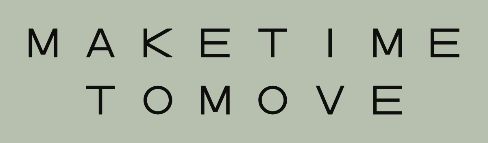
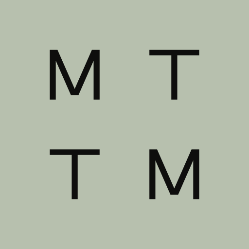
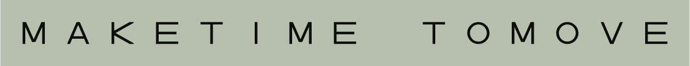
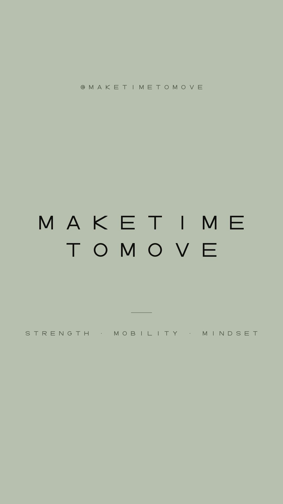
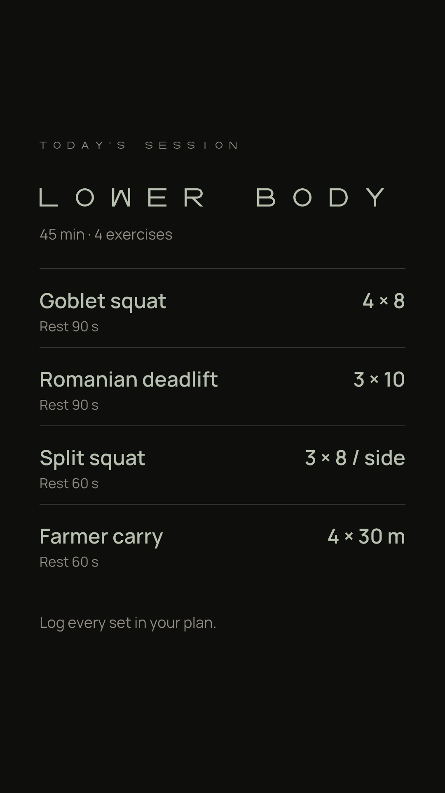

# Make Time To Move · Brand Guidelines

Version 2.0 · October 2026 · @maketimetomove

Version 2.0 is based on the brand as packaged in the Coach Console app: Ink on Sage, hairline rules, square corners and calm type. The single reference for the Make Time To Move identity across Instagram, the website, marketing materials and merchandise. Asset files live alongside this document in `brand/`.

## 00. Brand brief

Copy this summary into any new chat, brief or design tool so that future work matches the brand.

```text
MAKE TIME TO MOVE (MTTM) · @maketimetomove · Brand guidelines v2.0
Personal training brand and healthy-living movement. The name is a command that answers the most common reason for not exercising: "I don't have time."
Pillars: Strength, Mobility, Mindset. Signature series: stranger interviews asking "Why do you make time to move?"
Feel: minimalist, clean, confident, high-end, quiet. Restraint over loudness. Never gym-floor aggressive.
v2.0 follows the packaging of the Coach Console app: Ink on Sage, hairline rules, square corners, calm type.

LOGO: custom equal-width capitals, thin monoline (stroke = 12% of letter height). Every letter sits in a 1x1 square box. Letter gap = 1 letter, line gap = 1 letter.
  Wordmark (primary): MAKETIME over TOMOVE, centred, no word gap. 15 x 3 units.
  Monogram: M T over T M, same spacing, a 3 x 3 square. Avatar, favicon, app icon, small merch.
  Framed monogram: the monogram inside a square frame, 1 letter of padding, frame line = the letter stroke. App header, highlight covers, sign-offs.
  Single line: MAKETIME, one empty box, TOMOVE. Hats, sleeves, website header, narrow spaces.
  Heavy cut: same letters with a thicker stroke, for favicons, app icons and embroidery only.
  Clear space = 1 letter height on all sides. Always use the supplied files. Never retype the logo in a font.

COLOUR (two colours per layout, plus one secondary-text colour; tints of the lettering colour only for hairlines and fills):
  Master: Ink #0E0E0D on Sage #B7C0AE; secondary text Fern #4F5549. Used by the app, the profile, most stories and posts.
  Strength: Sage on Ink (secondary Stone #8F8B83). Start Here: the master.
  Mobility: Ink on Bone #EFEBE3 (secondary Fern #4F5549).
  Mindset: Mist #E3E7EC on Midnight #121A26 (secondary Slate #87909C).
  Interviews: Chalk #E8E6DD on Moss #1E2A23 (secondary Lichen #8C948D).
  Tints: hairlines = lettering colour at 20%, strong rules 40%, fills 5%, button borders 35%.
  Utility: pure Black #000000 and White #FFFFFF for one-colour reproduction.
  No gradients, effects, shadows, outlines or extra colours. Status is shown with Ink weight (solid, outline, light fill), never with red/green.

TYPE:
  Display: MTTM Lettering, the brand's own custom font (capitals only, spacing built in, so leave letter-spacing at 0). Titles, headlines, story/reel text, slogans, and labels with a cap height of 14 px or more. Regular for general use; Heavy only for small sizes and embroidery. Files: fonts/mttm-lettering-regular.woff2 / .otf and -heavy; embedded in tokens/mttm-brand.css and Appendix 14.
  Headings: Manrope 600, sentence case, tight (app page titles, quotes, list items).
  Body: Manrope 400, sentence case, line-height 1.6.
  Small labels (under 14 px cap, e.g. app table headers): Manrope 500, capitals, letter-spacing 0.12em, secondary colour.
  Never substitute another typeface (no Michroma, no lookalikes).

VOICE: short, direct, imperative, calm. No hype, no fitness clichés, no exclamation marks. Examples: "Make time to move." "Start where you are." "Why do you make time to move?"

IMAGERY: natural light, real people, honest movement, muted or black-and-white colour, generous negative space. No stock gym imagery, no neon, no flexing for the camera.

RULES FOR AI ASSISTANTS AND DESIGNERS
  1. Use the supplied logo files (SVG or PNG). Never draw, retype or approximate the logo.
  2. Display text: MTTM Lettering only, capitals, letter-spacing 0. It is a custom font that exists only in the brand files: fonts/mttm-lettering-regular.woff2 / .otf (and -heavy), tokens/mttm-brand.css (font embedded), or Appendix 14 of these guidelines. Never substitute Michroma or any other typeface. If you cannot access the font, ask for the files before producing work.
  3. Everything else: Manrope (400 body, 600 headings, 500 spaced capitals for small labels).
  4. One theme per layout. Default to the master, Ink on Sage, unless the content belongs to a pillar theme.
  5. Separate content with hairline rules and space, not boxes. Square corners, no shadows, no gradients.
  6. Keep on-image text to 8 words or fewer for headlines, in the brand voice.
  7. Instagram stories and reels (1080 x 1920): keep text out of the top 250 px and bottom 340 px; keep reel cover text inside the centre 1080 x 1080. Feed posts are 1080 x 1350.
  8. Start from the templates in instagram/ (or the Canva PDFs in instagram/canva/) rather than designing from scratch.
  9. Keep 1 letter height of clear space around every logo.
  10. When unsure, choose less: more space, fewer elements, one message.
```

### What changed in v2.0

- **Master colour is now Ink on Sage**, matching the Coach Console app, its icon and its PDF exports. Ink & Bone moves to the Mobility pillar and to print.
- **Fern is deepened to #4F5549** for small secondary text, as in the app (the lighter #5F665A stays for chart guides).
- **New mark: the framed monogram**, from the app header. Used for highlight covers, avatars and sign-offs.
- **Type hierarchy from the app:** MTTM Lettering for display; Manrope 600 for headings; Manrope 400 for body; Manrope spaced capitals only for labels too small for the lettering.
- **Layout rules from the app:** hairline rules instead of boxes, square corners, tints of the lettering colour for fills, status shown with Ink weight rather than colour.
- **New Instagram kit:** story, reel and feed templates for tips, workouts, progress, questions, interviews, captions and carousels, each with an editable template and a Canva-ready PDF.

## 01. Concept

**Make Time To Move** is a training habit for a healthy way of life. It is a movement first, and a coaching business second. The name is a command. It answers the most common reason people give for not exercising, “I don’t have time,” with a calm instruction instead of a pitch.

- **Strength:** training that builds capability for everyday life.
- **Mobility:** moving well, recovering well, staying able.
- **Mindset:** the habit itself. Its signature format is street interviews with strangers, asking “Why do you make time to move?”

The identity follows the same idea. One unit of space repeats everywhere: every letter is the same size, and every gap is the same size. The structure is visible, calm and unhurried. Nothing shouts.

## 02. Logo system

Four marks drawn from one set of custom letters. Always use the supplied files and never retype the logo.



| Mark | Use | Files |
|---|---|---|
| **Wordmark** (primary) | Default for everything with room: website hero, posters, merch fronts, decks. | `logo/wordmark/` |
| **Monogram** M T / T M | Instagram avatar, favicon, app icon, chest prints. | `logo/monogram/` |
| **Framed monogram** | The monogram in a square frame (1 U padding, frame line = the letter stroke). App header, highlight covers, avatar, sign-offs on stories and posts. | `instagram/avatar/`, `instagram/highlights/` |
| **Single line** | Hats, sleeves, back yokes, website header bar, email footers, narrow spaces. | `logo/single-line/` |
| **Heavy cut** | The same letters with a thicker stroke. Only for favicons (≤ 64 px) and embroidery. | `logo/monogram-heavy/`, `logo/wordmark-heavy/`, `logo/single-line/*-heavy-*` |





## 03. Construction

The unit **U** is the letter height. Everything in the identity is measured in U.

- Every letter sits in a **1 U × 1 U** square. All letters share that width and height.
- Gap between letters: **1 U**. Gap between the two lines: **1 U**. The wordmark is 15 U × 3 U.
- Line 2 (TOMOVE) is centred under line 1 (MAKETIME) on the same columns. There is no word gap: the line break separates the words.
- Monogram: M T over T M with the same gaps, giving a **3 U × 3 U** square.
- Single line: MAKETIME, one empty box, TOMOVE, giving 29 U × 1 U.
- Framed monogram: the 3 U monogram inside a 5 U square frame (1 U padding), frame line 0.12 U, the same as the letter stroke.
- Stroke: 12% of U for the regular weight, the same as the regular font weight. The heavy cut is 22%.
- The letters are custom: square boxes, a circular O, a plain-stroke I, and a K made of two straight diagonals meeting the stem. No font reproduces them, so never retype the logo.

## 04. Clear space & minimum sizes

Keep at least **1 U** (one letter height) clear on every side of any mark. Nothing goes inside that zone: no text, edges, other logos or busy image detail. All supplied files already include it.

| Mark | Digital minimum | Print (paper) | Screen print | Embroidery |
|---|---|---|---|---|
| Wordmark | 160 px wide | 40 mm wide | 75 mm wide | Heavy cut, ≥ 100 mm wide |
| Monogram | 64 px (regular) · 16–48 px heavy cut | 15 mm | 20 mm | Heavy cut, ≥ 25 mm |
| Framed monogram | 40 px (as in the app header) | 15 mm | 25 mm | Not recommended (thin frame) |
| Single line | 300 px wide | 120 mm | 150 mm (heavy cut ≥ 90 mm) | Heavy cut, ≥ 120 mm |

Below the wordmark minimum, use the monogram. At 16 px the monogram reads as a recognisable square, not as letters. That is expected for any four-letter mark.

## 05. Colour

The master is Ink on Sage, as in the Coach Console app. Four pillar themes, each two colours plus one secondary-text colour. One theme per layout; never mix themes.

| Colour | HEX | RGB | CMYK (approx.) | Role |
|---|---|---|---|---|
| Sage | #B7C0AE | 183 192 174 | 5 0 9 25 | Master ground (app canvas, stories, profile) |
| Ink | #0E0E0D | 14 14 13 | 0 0 7 95 | Master lettering, marks and text |
| Fern | #4F5549 | 79 85 73 | 7 0 14 67 | Secondary text and small labels on Sage (app muted) |
| Fern-Light | #5F665A | 95 102 90 | 7 0 12 60 | Secondary marks on Sage: chart guides, planned values |
| Bone | #EFEBE3 | 239 235 227 | 0 2 5 6 | Paper ground; light lettering on Ink |
| Stone | #8F8B83 | 143 139 131 | 0 3 8 44 | Secondary text on Ink |
| Moss | #1E2A23 | 30 42 35 | 29 0 17 84 | Interviews ground |
| Chalk | #E8E6DD | 232 230 221 | 0 1 5 9 | Light on Moss |
| Lichen | #8C948D | 140 148 141 | 5 0 5 42 | Secondary text on Moss |
| Midnight | #121A26 | 18 26 38 | 53 32 0 85 | Mindset ground |
| Mist | #E3E7EC | 227 231 236 | 4 2 0 7 | Light on Midnight |
| Slate | #87909C | 135 144 156 | 13 8 0 39 | Secondary text on Midnight |
| Black | #000000 | 0 0 0 | 0 0 0 100 | Utility: one-colour reproduction |
| White | #FFFFFF | 255 255 255 | 0 0 0 0 | Utility: one-colour reproduction |

*CMYK values are mathematical starting points, not colour-managed. For print and merch, ask the printer to match the HEX values to a physical swatch (Pantone or their own ink system) and approve a proof before a run. For large solid Ink areas on paper, use a rich black (C60 M40 Y40 K100).

### Themes by pillar

| Pillar | Theme | Lettering | Ground | Grey (secondary) | Contrast |
|---|---|---|---|---|---|
| Start Here | Sage (master) | Ink #0E0E0D | Sage #B7C0AE | Fern #4F5549 | 10.3:1 |
| Strength | Ink (inverse) | Sage #B7C0AE | Ink #0E0E0D | Stone #8F8B83 | 10.3:1 |
| Mobility | Bone | Ink #0E0E0D | Bone #EFEBE3 | Fern #4F5549 | 16.2:1 |
| Mindset | Midnight | Mist #E3E7EC | Midnight #121A26 | Slate #87909C | 14.1:1 |
| Interviews | Moss | Chalk #E8E6DD | Moss #1E2A23 | Lichen #8C948D | 11.9:1 |

- **Ink on Sage is the master.** Use it for the app, the profile, the website, general stories and posts, and Start Here.
- Secondary colours (Fern, Stone, Slate, Lichen) are only for secondary text, labels and captions, never for logos.
- Tints: only the lettering colour, at fixed strengths: hairline rules 20%, strong rules 40%, fills 5%, button borders 35%.
- Status without extra colours, as in the app: blocking = solid Ink block, warning = Ink outline, information = 5% fill.
- Charts: actual values in Ink, planned values and guides in Fern Light #5F665A, axis labels in Fern.
- Black and white are utilities for one-colour jobs: stamps, single-ink prints and partner logos.
- Approved logo pairings are exactly the lettering/ground pairs above, plus each pair inverted, plus single-colour logos on photography with enough contrast.

## 06. Typography

| Role | Typeface | Setting | Use |
|---|---|---|---|
| Logo | MTTM custom lettering | Supplied artwork only | Logos. Never typed. |
| Display | MTTM Lettering (brand font, `fonts/`) | Capitals · letter-spacing 0 (built in) · Regular; Heavy for small sizes | App page titles and sign-in, story and reel headlines, post statements, slogans, labels with cap height ≥ 14 px |
| Heading | Manrope 600 | Sentence case · tight (-0.01em) · line-height 1.2 | App screen titles and section heads, quotes, list items, exercise names |
| Body | Manrope 400 | Sentence case · line-height 1.6 · 15–18 px on screen | Captions, descriptions, website copy, emails, documents |
| Small label | Manrope 500 | Capitals · letter-spacing 0.12em · 11 px · secondary colour | App table headers, badges, stat labels: anything too small for the lettering |

### The alphabet · MTTM Lettering

This is the brand font. Every character below is drawn from the font files. Letters and figures sit in a 1 U square; punctuation is narrower. In use, characters are 1 U apart and words are 3 U apart.

Character set (Regular and Heavy): `ABCDEFGHIJKLMNOPQRSTUVWXYZ0123456789.,:!?'’"-–—/·@+#()&` · lowercase keys type capitals.

- Square box for every letter and figure; constant stroke of 12% of the letter height (Heavy: 22%).
- O is a perfect circle; 0 (zero) is a rounded square; I is a single stroke; K is two straight diagonals meeting the stem; W is M upside down.
- A, M and V have small flat points rather than sharp tips. C, G, S, 2, 3, 5, 6, 8, 9 are built from the same ellipse geometry as the O.
- Spacing is part of the font: 1 U between characters, 3 U between words. Always leave letter-spacing at 0.

- MTTM Lettering is the logo’s alphabet: every character in a square box, a circular O, and 1 U gaps between characters and 3 U between words. The spacing is built into the font, so always leave letter-spacing at 0.
- Install `fonts/mttm-lettering-regular.otf` and `-heavy.otf` for Canva, Figma and desktop apps. Use the `.woff2` files on websites.
- Capitals only (lowercase keys type capitals). Keep lines short: 2 to 4 words, centred or left-aligned, never justified, never for paragraphs.
- Characters: A–Z, 0–9 and . , : ! ? ' " - – — / · @ + # ( ) &. The zero is a rounded square so it is never confused with the circular O.
- Below a 14 px cap height (app UI labels), use Manrope 500 spaced capitals instead of the lettering. Use Heavy only for small marks and embroidery.
- The logo stays fixed artwork. Never type it, even though the font has the letters.
- On websites, load MTTM Lettering from `tokens/mttm-brand.css` (font embedded) or the code in Appendix 14. Never substitute another typeface. The generic `sans-serif` keyword is the only fallback and should never be visible.

## 07. Instagram & social

A ready-made kit in `instagram/`, built in the app’s packaging. Every template comes three ways: a finished PNG, an editable SVG in `templates/` (Figma, Illustrator), and a Canva-ready PDF in `instagram/canva/` with editable text.

### Stories · 1080 × 1920





### Interviews · Moss

### Profile, highlights and reels

### Feed posts · 1080 × 1350

| Template | Theme | Use |
|---|---|---|
| Opening page (`stories/mttm-ig-story-cover`) | Master; inverse and Bone versions | First frame of a story set or a Start Here highlight |
| Tip / list (`story-tip`) | Pillar (example: Mobility) | Three short steps: one line each plus a detail line |
| Workout (`story-workout`) | Strength | A session from the app: exercise, sets × reps, rest |
| Weekly progress (`story-progress`) | Master | Sessions done this week, shown with solid and outline squares like the app |
| Question (`story-question`) | Master | Leave the marked space for Instagram’s question or poll sticker |
| End card (`story-end`) | Master | Last frame: framed monogram, one line, follow prompt |
| Interview title, quote, lower third | Moss | Open the interview, pull out the answer, name the person |
| Reel cover (one per pillar) | Pillar | Keep text inside the centre 1080 × 1080 |
| Reel caption and title overlays | Strength (transparent PNG) | On-screen text over video: a solid block, never a shadow |
| Statement and carousel posts | Master / pillar | One statement, or a 3–7 slide how-to with a cover and an end slide |

### How to make a new post

- **Canva (easiest):** upload the two MTTM Lettering `.otf` files as brand fonts (Canva Pro), then import a PDF from `instagram/canva/`. The text stays editable. Change the words, export PNG at 1080 px wide.
- **Figma or Illustrator:** open the matching file in `templates/`. Install MTTM Lettering and Manrope first.
- **Instagram’s own text tool** cannot use the brand fonts. Add text in Canva or Figma, then upload the finished image. Use Instagram stickers (polls, questions, links) only in the space the templates leave for them.
- **Another Claude chat:** give it these guidelines plus `tokens/mttm-brand.css` and the `instagram/` folder, and ask it to start from the closest template.

### Weekly rhythm (suggested)

- One interview a week (Moss): title card, video with lower third, answer quote.
- Two pillar posts a week, alternating Strength (Ink) and Mobility (Bone): a carousel or a reel.
- Stories most days: a workout or tip, and a weekly progress story on Sunday, in the master.
- The grid then reads as Sage with regular blocks of Ink, Bone and Moss, interleaved with photography.

### Feed aesthetic

- The grid reads as calm blocks of the theme colours, mostly Sage, interleaved with photography. Don’t chase every trend.
- Each post uses one theme, and the theme follows the pillar.
- Use typography posts for questions and principles: MTTM Lettering, centred, generous space, at most 8 words.
- Captions follow the voice: short, plain, no emoji clusters, few hashtags (3 to 5, at the end).
- Interview videos open on the title card, use the lower third for the person’s name, and close on the monogram.

### Imagery

- Natural light, real places, real people mid-movement. Honest effort over posed perfection.
- Grade toward muted, slightly cool colour, or black and white. Skin looks like skin.
- Leave negative space for type. Frame interviews at eye level, subject centred, handheld but steady.
- Avoid stock gym imagery, neon, heavy filters, shirtless flexing for the camera, and before/after shots.

## 08. Product & UI · Coach Console

The app is the reference implementation of v2.0. These are its rules, for any screen, website or tool.

- **Canvas** Sage, **text and marks** Ink, **secondary text** Fern #4F5549. Theme colours are CSS roles (canvas, fg, muted) so a pillar theme can swap them in one place.
- **Header:** the framed monogram (40 px, 1 U padding) at the left, plain text navigation, one primary action.
- **Type:** MTTM Lettering only for static page titles and the sign-in screen. Screen titles in Manrope 600 (24–28 px). Body 15–16 px Manrope. Table headers, badges and stat labels in Manrope 500 capitals, 11 px, 0.12em spacing, Fern.
- **Structure:** sections separated by a 20% hairline and space, not boxed. Panels use a 5% Ink fill. Square corners (0–2 px), no shadows, no gradients.
- **Buttons:** 44 px tall on phones. Default = 35% Ink outline; primary = solid Ink with Sage text; destructive = underlined text, not red.
- **Fields:** 30% Ink outline, Sage fill, 16 px text on phones (stops iOS zoom), Ink focus ring.
- **Status:** blocking = solid Ink block with Sage text; warning = Ink outline; info = 5% fill. Never red, amber or green.
- **Icon and theme colour:** app icon and favicon are the heavy-cut monogram, Ink on Sage. Browser and phone theme colour #B7C0AE.
- **Exports (PDF plans, week sheets):** Sage pages, Ink text, MTTM Lettering titles, Manrope body, the logo from the supplied artwork.

## 09. Website & digital

Design tokens are in `tokens/mttm-tokens.css` and `tokens/mttm-tokens.json`. Use them to theme any site, app or deck so it matches the brand.

- Default theme: Ink on Sage, the same as the app. Pillar pages may switch theme via `data-mttm-theme` (strength, mobility, mindset, interviews).
- `tokens/mttm-brand.css` also includes the app’s components: `.mttm-caps` labels, `.mttm-title`, `.mttm-section` hairline sections, `.mttm-panel`, `.mttm-btn` / `.mttm-btn-primary`, `.mttm-input`, and `.mttm-note-alert` / `-warn` / `-info`.
- Header: the single-line logo at 240 to 360 px wide. Footer: the monogram. Favicon set: `logo/favicon/`.
- Layout: generous whitespace on an 8 px spacing scale, content up to about 1200 px, centred hero with the wordmark.
- UI: follow section 08. Square corners, hairline rules, no shadows or gradients; buttons labelled in Manrope 600.
- Body text: Manrope 17 to 18 px, line-height 1.6, at most about 70 characters per line.

```html
<link rel="icon" href="/favicon.ico" sizes="any">
<link rel="icon" href="/favicon.svg" type="image/svg+xml">
<link rel="apple-touch-icon" href="/apple-touch-icon.png">
<link rel="stylesheet" href="mttm-tokens.css">
<body data-mttm-theme="strength"> … </body>
```

## 10. Merchandise

Print-ready files are in `merch/`: transparent, one colour, as SVG (vector, preferred by printers) and PNG at 300 dpi.

| File | Mark | Print width | Use |
|---|---|---|---|
| `merch/front-wordmark/` | wordmark | 11 in (279 mm) | Tee / hoodie full front |
| `merch/back-wordmark/` | wordmark | 12 in (305 mm) | Tee / hoodie full back |
| `merch/chest-monogram/` | monogram | 3.5 in (89 mm) | Left chest print |
| `merch/chest-monogram-embroidery/` | Heavy cut monogram | 3 in (76 mm) | Left chest embroidery |
| `merch/hat-monogram-embroidery/` | Heavy cut monogram | 2.25 in (57 mm) | Cap / beanie front embroidery |
| `merch/yoke-single-line/` | single line | 10 in (254 mm) | Back yoke / across shoulders |
| `merch/sleeve-single-line/` | Heavy cut single line | 3.5 in (89 mm) | Sleeve or hem (heavy cut) |

| Garment | Print / thread |
|---|---|
| Sage | Ink (master) |
| Ink (black, vintage black) | Sage or Bone |
| Bone (natural, ecru) | Ink |
| Moss (forest, dark green) | Chalk |
| Midnight (navy) | Mist |

- One colour per garment. Use screen print or DTG for prints, and embroidery for caps, beanies and chest marks.
- Embroidery always uses the **heavy cut** artwork, because satin stitches need a stroke of about 1 mm or more.
- Match garment and ink colours to the palette by physical swatch, and approve a sample before ordering a run.
- Set slogans in MTTM Lettering, as one or two short lines, using brand-voice lines only.
- Place a small monogram woven label or neck print on garments whose front carries a slogan.

## 11. Brand voice

Short, direct, imperative. Calm confidence. Say less, and mean it.

| Do | Don’t |
|---|---|
| Short sentences. Verbs first. | Long build-ups, rhetorical hype. |
| Plain words a friend would use. | Fitness clichés: “beast mode”, “no excuses”, “crush it”, “grind”, “shred”. |
| Invite: “Start where you are.” | Shame: “What’s your excuse?” |
| Full stops. | Exclamation marks, all-caps shouting in body text, emoji strings. |
| Real people, real reasons. | Transformation promises, “summer body”, before/after framing. |

## 12. What not to do

- Don’t add gradients, shadows, glows, outlines, textures or any other effect to the logo.
- Don’t stretch, squash, rotate, skew or re-space the letters. The equal spacing is the logo.
- Don’t type the logo, not even in MTTM Lettering. Always use the supplied artwork.
- Don’t recolour outside the approved pairs, and don’t put two theme colours in one logo.
- Don’t add a word gap, or move TOMOVE off-centre.
- Don’t place the logo on busy photography without enough contrast, or inside its clear space.
- Don’t lock the logo up with taglines, icons or other marks. Keep each mark on its own.
- Don’t use the heavy cut at large sizes on screen. It exists for small sizes and thread.

## 13. Files & naming

Everything is prefixed `mttm-`, then the mark, then the colourway (`lettering-on-ground`, or a single colour for transparent files), then the size in pixels for PNGs.

| Folder | Contents |
|---|---|
| `logo/wordmark/` | Wordmark: SVG plus PNG at 600, 1200 and 2400 px wide, in 13 colourways (master: `ink-on-sage`) |
| `logo/monogram/` | Monogram: SVG plus PNG at 128, 512 and 1024 px, in 13 colourways |
| `logo/monogram-heavy/`, `logo/wordmark-heavy/` | Heavy cut for favicons and embroidery |
| `logo/single-line/` | Single-line logo, regular and heavy |
| `logo/variants/` | Layout study: variant A (centred, chosen) and B (nested) |
| `logo/favicon/` | favicon.ico, favicon.svg, 16 / 32 / 48 px, apple-touch-icon, 192 and 512 px icons (Ink on Sage, as the app icon) |
| `instagram/` | Social kit: `avatar/`, `highlights/`, `stories/`, `interview/`, `reels/` (+ `overlays/`), `posts/`; editable SVGs in each `templates/` folder; Canva-ready PDFs in `canva/` |
| `merch/` | Print-ready transparent files in Bone, Ink, White and Black |
| `fonts/` | MTTM Lettering font files: OTF (install for Canva, Figma, desktop) and WOFF2 (websites), Regular and Heavy, plus a specimen page |
| `tokens/` | `mttm-brand.css` (self-contained: tokens plus the embedded brand font), `mttm-tokens.css` and `.json` |
| `_src/` | Source fonts and the build scripts that generate every file |

Typefaces: MTTM Lettering is the brand’s own custom font. Michroma (© Vernon Adams, SIL Open Font License) was the original drawing reference only and is not part of the brand. Manrope (© Mikhail Sharanda) is free under the SIL Open Font License.

## 14. Appendix · web font code

The complete MTTM Lettering font, embedded as code. Paste it into any website’s CSS and the brand font works with no other files. Use it whenever the font files themselves are not available.

- The same code, on single lines, is in `tokens/mttm-brand.css`. Prefer that file when you have it.
- As shown, this is valid CSS: each line inside the data string ends with a backslash, which CSS reads as a line continuation. If you join the lines, delete the backslashes and line breaks so the base64 data is one unbroken string.
- Then set headlines with `font-family: 'MTTM Lettering'`, capitals, `letter-spacing: 0`. Never substitute another typeface.

```css
@font-face {
  font-family: 'MTTM Lettering';
  font-weight: 400;
  font-style: normal;
  font-display: swap;
  src: url('data:font/woff2;base64,\
d09GMk9UVE8AAAo8AAkAAAAAETAAAAn2AAEAAAAAAAAAAAAAAAAAAAAAAAAAAAAADZZnBmAAgTIB\
NgIkA4FkBAYFhS8HIBuLEFGUTVYS4GMx3fiCDIYkSd7hPEKS2b+nOfub7P+7taAhR5LZTTVISaGW\
CjXBg1gNqYhDz2qpGecV90ChojkNFU/FeJu+5UCE2w5BiJpQopwoUva/a5nNlElj3qtcoctG1sg2\
s787fzE7JUoJUBHIKgXA54iFP41k/AkjTucQg2xjXpdULPULcDNrQuC/NYcvhAsXkpSRkfSH0DFv\
m6I+wohB78GomDTKNzy4MPDrHl8+feLnNNcZGghRARh6A63FMnWwWAmH/xWkwSQBg/gh9RATokEs\
yDBERLSIDhmLLMAfmYDUR+oiPFIrREDaFsIxkiRY5XPBXDOuJ1fCHeTOcu80oZpwTbpmouaM5o02\
XbtC6+U1vJ3P5L/jj/H35xElNJmOpNvoKxbEurPf2UmhifC9sFjYJBwWysTaokFsJLYX48Qccag4\
W1xQK6hWdK2xtUpqXa6dY6bT4GOIz+FzVDvY1epgveJW3Kpb0BXZlvvMI12Pp3vdZ87bEKvUzjjG\
bjmerhxKsVDtqwcb/A82/J/quD0LZRwD/3ePqv7Mut5ph7x3z4aT54xVUY9QlNQ2zFOt1UOxYhbc\
ZVnx8YnZHWXVDOV02CJ4Ity6mF2Ynt1DlnyPjhAIAE3F21K5xxEa2791dqQJrVgHdBAJkXC6jfV1\
ZXbscfmWJP1tEqrrY4AJMzEGSSaC50KmrBbR5feERkArIJAaFfaUVZ1CqypH4IQAhirUYSSiJTUb\
KNv6HG5VhWLlknW/BEWK6q52MHCZB8qVn7rlJxBo/fX3hnAwQ/ff5MVuvN8RihmGTkdtYzTq/y4f\
ugviTsnXTtN/E6znkJ/opB2yDcs9Pocdr6nb4Jp9qTYJuVg+v7vCw3d6lE6AwQo2E2TCX7D5zeCj\
HT8KGIl1UIdWJLaKVwUS5z13MGU67qBgWM/UW/CPsjai69EgqJAlO+yCI/J8Wrv1v085wmC4OvWL\
E4YrU6l6xONzIBFwrnoC5yonKBLsGwJTilSgEOhz2FVgapECFAMdBsoiuAQDe2FaN++4BGQGmSMN\
s8jbp+JSIhiILx8DAVGPUZTVIubBG3r4TokQbl3MiotLz0qu79PdG+v3X5Svp9CHe1nM3/Ri6e5/\
nxpViaT0uXpOSCzsK+MPMDo9EWbhYDpxYP/ZuSbFnCDtI3MLXRS4Xxieg6P0qaKZSqhedPrZ8vLX\
eHbSNTte9rAqjHk0Fi0tSJ7MVpAJF1nx8ShKRiudkOzMUiYtmZ8LH1UBIYQEaOPT6sFVrfXkk8CV\
1rnwUW91YnAmkrIIPMFAcoaoX9OaQ/oa9dO6nvIp2gmnqx2fnLACYdyhZ+sCEWCucsIr1BMUSDK0\
OcJwuDK1vvOrUadS5Uiy1fnMYAHs9bVwL/1cwvAYPIG1nJY0EJBHrAvaYDazDHyCLotxVnJ/f6Mi\
BsdVbs5suhldHnBtZnNK4LjC0XWNBHSiiybzav8w5R9lG31W7ei4UQQqWd3Gq+BSCOyKzm7vwF+G\
ZQL4R71DUUI+EMUoKxIMRP+XVmjg5nukV/yDWP7PxYpb0tGCWxfj2iHVtkuP6yGV51UCmbeUYtws\
hi7McYaBC7KV6aos0ntYBdQ5F9h1s+KkUUw9r3aiYzuqSTY22KiE0Q1C4IyPo71SCyRSg93ufp/y\
7jvlg3s3nrowqDV3VMysj2aoPTvq+3Ra47jSeyLnQjwQDzY32pS27LffUedUO6hJdHpHpZApzXh8\
hPcFcaSwzFD1EkTsbHmJBlnVQV7Hs6Kv/DaVN1O6du2Z0lpWC4s63Qt1UcH0RWLmyFHz546RIQ+2\
oMaJc/HPxMGFOXNTQ6cLWGs52GyQZnLz2ABrXbn3g7yOPQSR/nb88toyk2dEYseOOOUih7QtU84y\
1b+LT07Fv7vRQzrRZ3pUdSPxatRuuWLv4fNXjVVoeoTt8DBTS0vK4cyKoVLU8MSUXsa6QKlBdUEg\
dBVUX4ZyHutGlFXvWWO4N3sqEZepbl2ylBeZGBNBxqMC6UuEzJ07lizbJmMebgGNE+bCn2X7D51Z\
djn0VwFq/Yi2F5hm6shDA6jl6LJCLmKtUKTT+qcWJ14jiDK3G+bmYJV1vp3wMeTZs2h27pC1LBP9\
6YK7wnkIpMtBgJQLo3ncjasgR+9RFtnZvGqHHpBu5r0/rqwc94mVPj4NBDzOTUpqkYtEGlaAsR4I\
FsBU8vHPV8ZPGFCJzbBLQOuGEhSrK3kk+zZl6HKQY78g1tdh8Wsq5oDID+wKvMDlRpcKhi0XBSlF\
brXIlU5L9jniJfgxvt8iXx/OkBNvnOB+DdS4ZLisAkT0o24DwzuQTshLS9iqHct27W7OvHghvuI5\
ciTk2SezkgljV44y2Tp3ttnud35x+uj63TtkqM2aFtjikJggnu8/+NDp0/sPHT++vzA3d3Bhf1ln\
5mcZVycekz2QnGq4MR6S7JjEVhuKStFFvQdiwYKxw0I3Wt5MaiHWjrHDwo5gCR/WYzAJuun3p38j\
6L52VCp9+XqsHxeBMrYyYisvyhB7S08E25XkDyAaQXR9eHFFUjvDR43mwguHqzGKdcTkxjaH9LWB\
+hVekKGVlbWKABndIHXk3TqGAP8rwwYQRJesWLISn9Xkpd9AMzcOyWPYBqz0RcntO4+M3hZ/IkEt\
OkRMXjZl5VTJy2b+8u36jcbzp4+Wlp7Oy8wbcaasWFok7+zZ49+JacbMhQtmytN+wVDnmf607eCM\
nh2MWBeCI6DFI/e24+ckvADr9TAXR9FRQ9KmJpqQjy5zXzx56tZ6WUe0rZpbRjreQdw5aLHb2GuQ\
ziwrVPtDDRMEHI7nmodFBLFcYESNwZmBm3vzfntZZv606mooXDNttdNZH/lm+MNdwZbQmhpCiEUT\
kaK100kX+Qow7IPqE0JqvDVv2195vuZazfqagpqZlebKIMIxayAMIYQ0dfDmOOGitNJGpNbsWrKy\
aSJGhBY4hHDI5/FdG+b5xX4RtdoXhBDy7OWLNeNOXMua73ijptw6k4avkfiC061w4gYsQzgH2Laq\
DFhlLEPe+aEdWzUrzGbcyAyB74gPXbUG0lI75rzX3LX+0l3yPpnfMhb8GG6QDsY4qxFR1e441g53\
JMSBtEWIvyteIBFwnnJ0IqiGoA3VMulEeSH6UKqecZTRm320KMAKFddqEUIybDxPOWZANXQJolqt\
U5/ymiabUsZ8T5mI/FohapCrT2Wzh8fUjLH/B3vtIxjyA+rmUXcwJ7Dd34TJ4HdeRfsYWzQM4f4p\
PAQPaINxGFirI0mSAiMNZpFhuNHncGwmJeEUDm2h0c1kE02Co2dGoQknvccYhKNUOAlxMC8Nx6Fn\
MpJkICYpwk/MSDM4w8lnsYAH7MFmE0UNG7YXwyb6cOgyJrLMDVlwnBg4NiaycBq+/OH6afZaBw==') format('woff2');
}

@font-face {
  font-family: 'MTTM Lettering';
  font-weight: 800;
  font-style: normal;
  font-display: swap;
  src: url('data:font/woff2;base64,\
d09GMk9UVE8AAAogAAkAAAAAETAAAAnZAAEAAAAAAAAAAAAAAAAAAAAAAAAAAAAADZZ9BmAAgTIB\
NgIkA4FkBAYFhRcHIBuJEFGUUFYXwI+E7CTzgiCyGVLbTUXjwG70ifMISWb/f5zuX9q8lxT250Xa\
niTotIEZ7htFpaNDg9hwKWLazTGV8WXfht90NzsQwc77SgLMAk1jiqnJyLf+JwAX/L/7vdqkAOAw\
p9UVEo2ukQ/u70v6SpBymhIlRR4qAgXCVQ+Y3Vih3fFAakLK6VRRJF2jdo+xDVybRnBa4sEci80K\
hy+Eg4Hw5M6dk/8QOovbrvPzr6y6h7bpdpPu4OE6hhZn+/vTP4K8jtLTQqFaCDGFs9q6lipbbwUG\
KCcc/m+QioOEdBKE/IbYEROiIIMRETEjgchIZBHByBikAhKA8IglREBqF8KxkbS13seFctW5NtxG\
7hh3hftmkk1xpt6m6aaLpm/mruZ15s+8yNfl+/FL+Kv8NxpOB9B59BKzsASWxs6xN0JzYaeQLVwT\
3gq6WEdsLXYXB4np4nxxnZgtnrG0sAy0LLcct3wqpTnoRPhaxu/yu0pc7FpJuFV/rj83nguBDjpx\
X6YXVbkVlz2ToKb32kmBerCEITS0YRu1y1BsaDisTyD1CabSwNFekz6KQXBRIYiPPLfa58nbfGtz\
8m0gOgtRlIxaDFTjshUUeCrk+zSPR9M8Mj6FzFXiNsG3R47RNPn6wvyuMhACpjv/35Ax/CVNHtLO\
3dSOJKEQRBALCoE8uulOzpKhzv9Pxl4dQ+zYBeMQdWHAm6GLjAsFtraAymAbyHD3YwvZCMRzNb0W\
jBP+eupEEcVGTrWb4neBYhzNAfp0bDBdN5W4WAsNVMjUO1f9OxfA/uX1oSIEQGKGvAoUfIoKxLHa\
o5p0qAE/6faVId2yD73UH/RN24jzyG+cybgDM3mC34VqguGATJgQme0al4kqgofZJ5dOQtkIUO3Q\
BeJgqJ8BX1HFrwKKCU4kzVPyrw6WRr+gh8Fj9FBIz2VGOtzRs6C5mD5h1xzoQVVgyP76ZVSZcIki\
9hVzIcX7FXIpFsFROgqYaKRkrqdQvaj5SfQFDN4ZCygMg0wNJwLf6bU4jG8WYpAPjtt8F4bsBQrP\
wTpQ8JMBXYuZJa7DJ9YUVFgQ4Cy4N9mYzkDFFVbg4ZPg2zNG08aM0a+/1LVLm/aelk+mUpDeslbX\
6JErex49t8HIXvrpabMGTdFkbA/1KqMA9TGGzp8yZdFkO67v030GOXidQtd9DNdBFj0F81R6LSuS\
BF9+foFv0kmaRwaVgfgWFW5sRlCgldClRZ8nQUPSq1NCldXSLtRCDj09CjBZv2yFvcZlUMWWsFe3\
m+GrlegCuWwqaRGwwSoH/agoZg6CtzEaZqQfv64XtpbwwxrCVO+wZ7Laz/sFs29yiQs6CpCop2Ru\
pFBta/RVilhlyMUUb2XMpVCkcCqkMKgFWuaoUa3vZLgUXkNodCemCFhh2EGpLhvPVh2+xmxPFagf\
5Nh2wpq+HItnTaMZeF0GIoPN2ugKKKbb62sIWBdnUb0+/jimj9PtFOqXuFCRVDCrDPuI8nIZyBSX\
WgTBMqwQmOIsQlFCPwlFZwQiNEIWRoCoHVIbk3eiZc+JPXk+aVb69qT1aTXUZ0yaJtnrnesvGKT9\
M2sXxR/pDPdiqBfrw14IpYJBS/pU5ivYI/BTj9Gk7szoYBDaAxW8SDqdBM/oYQEIrgItOGgCEsn3\
JtwbfL1L+o7M9fmHJzhQ0R3MxbYaLVCZcbwwNbSNFJ9/amjzDpSa8BfLz8OpXsNmBNKhqOipDN7x\
2Al7iMoqrSz7U72ocnWWlfG6Oyw3atW/5kSe5vGkaX1kI9XU+b8QgBTp54Jd5DlzvHPt0Bq2YXcv\
zsLPNE0bPWjOgIULymkCWlaCqkJHOyh8lZq+/Nnydnb0Fl2ffWL1WTuQgiH9+ycMQSKrdI/egeHt\
RyR74fYTSh/A3GAGN3LNfbFlnpyXvevYKRuIaC/EOnhFuxPFXrv65Q2WWqa5O7e3mQ7YvGOAjolp\
MmTydVqXeu74Xr++cze11uqYrPkXtMTCozEAKdAPCLrIq1d7V9mxNW6D7l6YBZ9pnm9vzupDy5aX\
8wlgmYfqX9jRjgr/5Z3mWSNPYP3b0hmD+8zpbkeSkHX0aEEWEDnQn+FNpIoqKzjZdQy1/mDPIZRu\
KF8TI5m7BW25J6h8H/ETult3ub7kdC4ocVlrdQf/L3zVV39eCNt3aeeDB5fGjxrVaXxzKaoB1gMV\
ygtg2fXh8QfbNwx5j9VQDalRSYJ+xpQzvrtHb00ru+4hxYNxJs5EcwMgs/c6KHgdgbvvDI+wtrDs\
VbXfJTzJj/DvZqpozHC92Q2NvbD+BlKrYS8MR8bfHRXKFoF0Ul6+ka3xrcjM8uQv+djhKaMz5UqL\
2ZL5C7zz7WqjRqr6tNFfZ47tzPLJh5lrcIqnuR3qwUPrxrFrRi0bIY5mWK+Tdc68DZs2rdzwnnbl\
9KlT502fIwc6+Kk0yghUIcwUAQpGgIqFEUsp6r0uYZf1HmC9pPYdVlSEeh1V9ZovRUVc8b35Oosb\
6O/9/a1YoXU0yphkw6R/UQbnghI0ErqdHnbvue15xr1zp6UIgq8XaCSc65nRsoGtwbCW3XpKXxUq\
3PkXZBhXICkaZNzghL7QkDI3r27ad1I+6qbQ5yBDCiYKFBQc2IdhGQilz3ZfuP3M9m/CCyQooX70\
+BXpqydI0HYkW7TQu2jxYu9i+7SNOM17ty1tO2BA+1Y2DIDwaEiQrkGkdf6k9IXp9ibts47u3bkr\
e6P8FgZax03cvA0ybN61a9uUid/KlHGyQoHE3ErMCqF4Qf6ZmFlPvU2qK7O8ee4v1hB3Ob7M9KJV\
DwVFerNw5nL7SN62N+UQzCxAJVGqqa2ORnrqb7IdnhmulP8FoqgqRnV1NNRYf+4WvmE6IeTXv/5f\
/+QFt+zkNuWOPwzHoaJIhBASK3h/nChOSWqJUUNNiSKoqooTLQGHEA7J3okR/YLq/RDN5r8IQv4o\
/GvdekYSfy2b6TZ1KSaEEOBFGT0dAVy5fRBOwGpXad9st3Ld+dXF5aaR4TVqfS1xvzzvG2wuixJh\
Wcb/G6HmYPwYfa7i97VP4Edw/Tx5OjUCqej6Yrv8nIS4kNoICXaVCzga8oQTKJqYULWIWXn1CS9c\
V0L9Zihhwky4sijEYhXXLISQzjbnCcehiJiUSmliFh8r4UWmJaFsGUmYqlnUK6qYnA9wW2+aVXQe\
+d+xh/c17LfZS7TXnZtRX4bam5Ve0Iq6cWp1WPElq+cteWi0Qu/l0VyRJHMbJo2isyGG59hIhpNZ\
usfUk7Gp8cYaZ3b1KFKNmYwcwcO0YOOQpfl4iD6IKllnZMkdWbdjrfSQW7pJLVfYbexcDq8rjqp6\
uPqxN1b2btc6NvawkWdjZZR1n3dd+bLjZgEA') format('woff2');
}

:root { --mttm-font-display: 'MTTM Lettering', sans-serif; }
.mttm-display { font-family: var(--mttm-font-display); text-transform: uppercase; letter-spacing: 0; }
```

